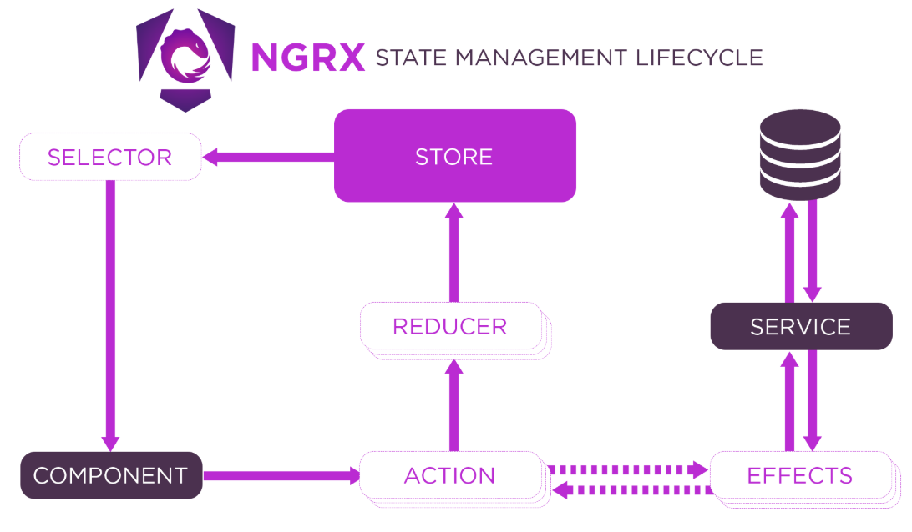

# Store

## ngxs VS ngrx

| **Feature**                  | **NGXS**                                                                                               | **NgRx**                                                                                              |
| ---------------------------- | ------------------------------------------------------------------------------------------------------ | ----------------------------------------------------------------------------------------------------- |
| **Purpose**                  | A simpler, more lightweight state management solution for Angular.                                     | A more complex, feature-rich state management solution inspired by Redux.                             |
| **API Design**               | Provides a more Angular-friendly API, using decorators and less boilerplate.                           | Uses a more verbose, Redux-inspired API with actions, reducers, effects, and stores.                  |
| **Learning Curve**           | Easier to learn and implement, especially for Angular developers.                                      | Steeper learning curve due to its use of Redux patterns and more complex setup.                       |
| **State Management**         | Uses simple stores and state models.                                                                   | Uses actions, reducers, and selectors, along with more explicit handling of side effects.             |
| **Side Effects Management**  | Provides an easier way to manage side effects with @Action decorators and @State lifecycle hooks.      | Uses **Effects** to handle side effects, with more boilerplate and setup involved.                    |
| **Stores**                   | Stores are simple and easy to set up with `@State` decorator.                                          | Requires setting up actions, reducers, and selectors explicitly for each slice of state.              |
| **Actions**                  | Actions are defined using decorators on methods, resulting in less boilerplate.                        | Actions are separate classes, and all action types are explicitly defined.                            |
| **Reducers**                 | Reducers are handled automatically by the `@Action` decorator and don't require as much boilerplate.   | Actions trigger reducers, which update the state based on the action type. Requires more manual work. |
| **Selectors**                | Uses simple functions or selectors to access state.                                                    | Selectors are more explicit, often requiring separate files to define them.                           |
| **Community & Ecosystem**    | Smaller community, less widespread but growing.                                                        | Larger community, widely adopted, and well-integrated with other tools.                               |
| **Integration with Angular** | Highly integrated with Angular's native features like `@State`, `@Action`, and `@Selector` decorators. | Built around the Redux pattern, which is not inherently Angular-specific.                             |
| **Boilerplate**              | Less boilerplate code, especially for simple state management tasks.                                   | More boilerplate, especially for complex state management needs.                                      |
| **State Immutability**       | State is immutable but can be mutated more directly than NgRx in some cases.                           | Strict immutability is enforced using reducers and actions, following Redux principles.               |
| **Persistence/Storage**      | Built-in support for state persistence through plugins or middleware.                                  | Persistence usually requires external libraries like **ngrx-store-localstorage**.                     |
| **Development Tools**        | Less mature tooling and middleware compared to NgRx.                                                   | Robust developer tools like the NgRx Store Devtools for debugging state and actions.                  |
| **Performance**              | Lightweight and optimized for smaller applications or simple state management.                         | More suitable for large applications with complex state and side effects.                             |
| **TypeScript Support**       | Excellent TypeScript support with decorators and automatic type inference.                             | Full TypeScript support, but requires more manual type definitions (e.g., for actions, reducers).     |
| **Debugging**                | Limited debugging tools compared to NgRx.                                                              | Excellent debugging tools like the NgRx Store Devtools and integration with Redux DevTools.           |

---

## NGXS

- state management pattern + library for Angular
- `modeled after the CQRS pattern popularly implemented in libraries like Redux and NgRx` but reduces boilerplate by using modern TypeScript features such as classes and decorators
  https://www.ngxs.io/

1. `@Store`
2. `@Action`
3. `@Selector`

- place where some transformation can be done

```ts
  @Selector()
  static getCounter(state: CounterStateModel): number {
    return state.counter;
  }
```

```ts
// counter.state.ts
import { State, Action, StateContext } from '@ngxs/store';

// Define the actions
export class Increment {
  static readonly type = '[Counter] Increment';
}

export class Decrement {
  static readonly type = '[Counter] Decrement';
}

export class IncrementByMultiple {
  static readonly type = '[Counter] IncrementByMultiple';
  constructor(public multiplePayload: number) {}
}

// Define the state model
export interface CounterStateModel {
  count: number;
}

// Create the state
@State<CounterStateModel>({
  name: 'counter',
  defaults: {
    count: 0,
  },
})
export class CounterState {
  // Selectors
  @Selector()
  static getCounter(state: CounterStateModel): number {
    return state.counter;
  }

  constructor() {}

  // Action to increment the count
  @Action(Increment, { cancelUncompleted: true })
  increment(ctx: StateContext<CounterStateModel>) {
    const state = ctx.getState();
    ctx.setState({
      ...state,
      count: state.count + 1,
    });
  }

  @Action(IncrementByMultiple, { cancelUncompleted: true })
  increment(ctx: StateContext<CounterStateModel>, action: IncrementByMultiple) {
    const multipleBy = action.payload;
    const state = ctx.getState();
    ctx.setState({
      ...state,
      count: state.count * multipleBy,
    });
  }

  // Action to decrement the count
  @Action(Decrement, { cancelUncompleted: true })
  decrement(ctx: StateContext<CounterStateModel>) {
    const state = ctx.getState();
    ctx.setState({
      ...state,
      count: state.count - 1,
    });
  }
}
```

```ts
export class AppComponent {
  // Select the count from the store
  count$: Observable<number> = this.store.select(CounterState.getCounter); // return Observable

  countSignal: Signal<number> = this.store.selectSignal(
    CounterState.getCounter
  ); // return Signal

  constructor(private store: Store) {}

  // Dispatch increment action
  increment() {
    this.store.dispatch(new Increment());
  }

  // Dispatch decrement action
  decrement() {
    this.store.dispatch(new Decrement());
  }
}
```

```ts
export const appConfig: ApplicationConfig = {
  providers: [provideStore()],
};
```

---

## NGRX

https://ngrx.io/guide/store



### Action

```ts
export const increment = createAction(
  '[Counter] Increment',
  props<{ value: number }>()
);

export const decrement = createAction(
  '[Counter] Decrement',
  props<{ value: number }>()
);

// old way
// export const INCREMENT = '[Counter] Increment'

// export class IncrementAction implements Action {
//   readonly type = INCREMENT;
//   constructor(public value: number) {}
// }

// export class DecrementAction implements Action {
//   readonly type = DECREMENT;
//   constructor(public value: number) {}
// }

// export type CounterActions = IncrementAction | DecrementAction;
```

### Reducer

```ts
import { Action, createReducer, on } from '@ngrx/store';

// import { CounterActions, INCREMENT, IncrementAction } from './counter.actions';
import { decrement, increment } from './counter.actions';

const initialState = 0;

export const counterReducer = createReducer(
  initialState,
  on(increment, (state, action) => state + action.value),
  on(decrement, (state, action) => state - action.value)
);

// old way
// export function counterReducer(state = initialState, action: CounterActions | Action) {
//   if (action.type === INCREMENT) {
//     return state + (action as IncrementAction).value;
//   }
//   if (action.type === DECREMENT) {
//     return state - (action as DecrementAction).value;
//   }
//   return state;
// }
```

### Selector [transformation]

```ts
import { createSelector } from '@ngrx/store';

export const selectCount = (state: { counter: number }) => state.counter;

export const selectDoubleCount = createSelector(
  selectCount,
  (state) => state * 2
);
```

### Dispatch

```ts
export class CounterControlsComponent {
  constructor(private store: Store) {}

  increment() {
    this.store.dispatch(increment({ value: 2 }));
  }

  decrement() {
    this.store.dispatch(decrement({ value: 2 }));
  }

  //old way
  // increment() {
  //   this.store.dispatch(new IncrementAction({ value: 2 }));
  // }

  // decrement() {
  //   this.store.dispatch(new DecrementAction({ value: 2 }));
  // }
}
```

### Select [get Value]

```ts
export class CounterOutputComponent {
  count$: Observable<number>;
  doubleCount$: Observable<number>;

  constructor(private store: Store<{ counter: number }>) {
    // for specific select [slice]
    this.count$ = store.select(selectCount);
    this.doubleCount$ = store.select(selectDoubleCount);

    // for whole reducer

    store.select('counter'); // `counter` is a key for reducer defined app.module
  }
}
```

### imports for Modules based

```ts
imports: [BrowserModule, StoreModule.forRoot({
    counter: counterReducer,
    // auth: authReducer
  })],
```

### imports for Standalone

```ts
providers: [provideStore({ counter: counterReducer })];
```

###
